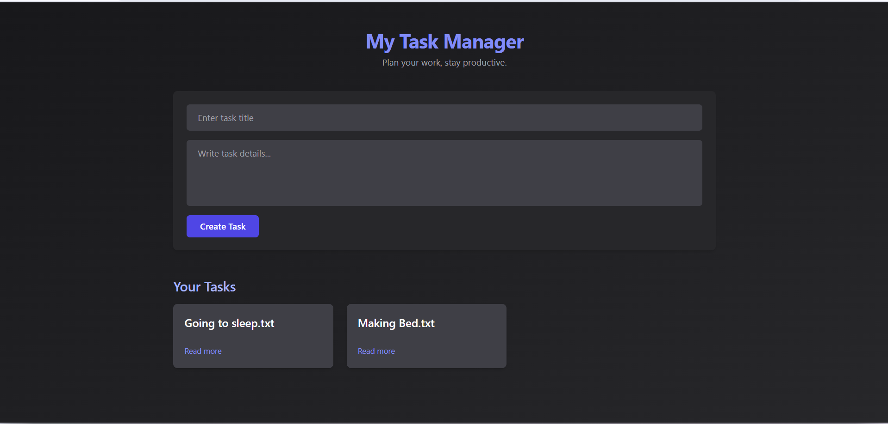
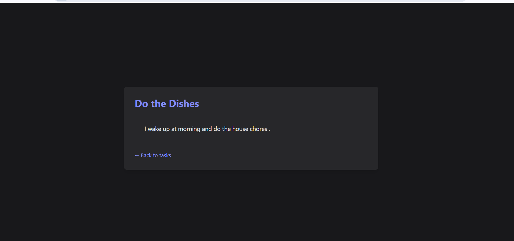

## 📸 Screenshots

### Dashboard View

### Task Creation Modal

# 📝 Task Manager App

This is a **full-stack task management web application** built using:

- **Node.js** and **Express.js** for backend logic
- **EJS** for server-side rendering of dynamic pages
- **Tailwind CSS** for a modern, responsive UI design

## 🚀 Features

- User registration and login
- Create, edit, and delete tasks
- Task status tracking (pending, completed)
- JWT-based authentication with cookies
- Responsive UI using Tailwind CSS

